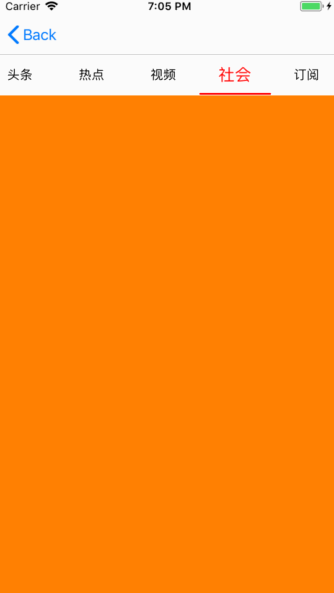

# HLSegmentViewController

[](https://travis-ci.org/2461414445@qq.com/HLSegmentViewController)
[](https://cocoapods.org/pods/HLSegmentViewController)
[](https://cocoapods.org/pods/HLSegmentViewController)
[](https://cocoapods.org/pods/HLSegmentViewController)

## Example


clone 项目 然后运行`pod install` 来看实例效果

简单易用的SegmentViewController，可以快速实现网易新闻，今日头像类似的主页效果

- 使用简单
- 方便易用 
- 对项目无浸入性




## Requirements

## Installation

HLSegmentViewController is available through [CocoaPods](https://cocoapods.org). To install
it, simply add the following line to your Podfile:

```ruby
pod 'HLSegmentViewController'
```

## 项目中使用

```
//创建实例对象
HLSegmentViewController *segmentVC = [[HLSegmentViewController alloc]init];
segmentVC = [UIColor lightGrayColor];
[self addChildViewController:segmentVC];

segmentVC.view.frame = self.view.bounds;
[self.view addSubview:segmentVC.view];


//创建需要添加的子控制器
NSArray *items = @[@"专辑", @"声音", @"下载中"];

TopLineViewController *vc1 = [[TopLineViewController alloc]init];

HotViewController *vc2 = [[HotViewController alloc]init];

VideoViewController *vc3 = [[VideoViewController alloc]init];


//调用实例方法进行创建
[segmentVC setupSegmentItems:items childViewControllers:@[vc1,vc2,vc3]];

```

## Author

2461414445@qq.com

## License

HLSegmentViewController is available under the MIT license. See the LICENSE file for more info.
